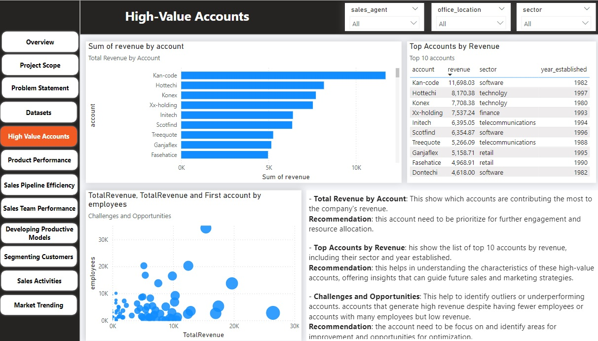

# Sales-Team-Performance
The project aims to analyze sales data to identify high-value accounts, evaluate product performance, assess sales pipeline efficiency, measure sales team performance, develop predictive models, segment customers, analyze sales activities, and understand market trends.

## Problem Statement 
1. Identifying high-value accounts based on historical sales data and account characteristics.
2. Analyzing product performance to understand revenue and sales** _volume trends_**.
3. Evaluating the efficiency of the sales pipeline to identify bottlenecks and suggest improvements.
4. Assessing the performance of the sales team by comparing metrics such as total sales, average deal size, and win rates.
5. Developing predictive models to forecast future sales opportunities.
6. Segmenting customers based on attributes like industry, size, and geographic location.
7. Analyzing the impact of different sales activities on closing deals.
8. Understanding market trends and external factors to identify new sales growth opportunities.

---
##Visualisation

**Features**
1. Overview of Analysis 😙
---

**Features**
1. Sales flow Analysis
---

**Features**
**Total Revenue by Account**: This show which accounts are contributing the most to the company's revenue.

**Recommendation**: 
- this account need to be prioritize for further engagement and resource allocation.
- the account need to be focus on and identify areas for improvement and opportunities for optimization.
- Need to identify high-potential accounts and focus sales efforts on these accounts.
- Increase sales efficiency and effectiveness, leading to higher revenue.
---

